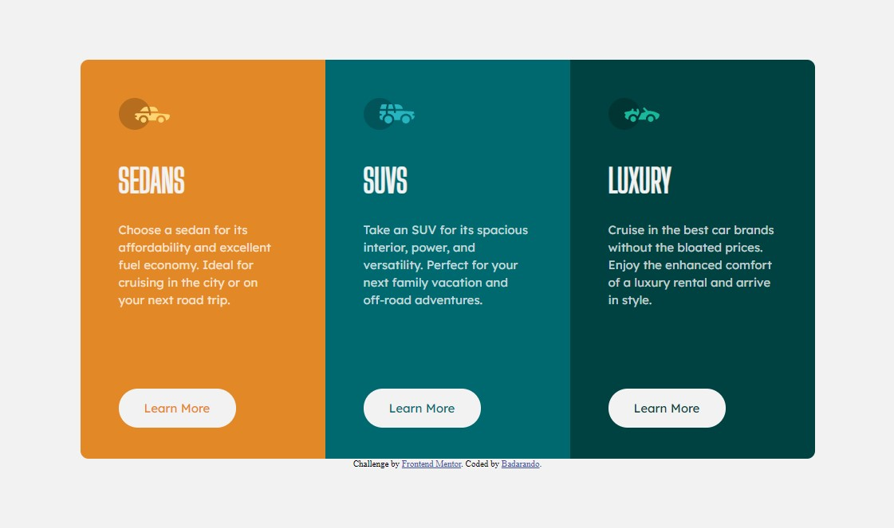

# Frontend Mentor - 3-column preview card component solution

This is a solution to the [3-column preview card component challenge on Frontend Mentor](https://www.frontendmentor.io/challenges/3column-preview-card-component-pH92eAR2-). Frontend Mentor challenges help you improve your coding skills by building realistic projects. 

## Table of contents

- [Overview](#overview)
  - [The challenge](#the-challenge)
  - [Screenshot](#screenshot)
  - [Links](#links)
- [My process](#my-process)
  - [Built with](#built-with)
  - [What I learned](#what-i-learned)
  - [Continued development](#continued-development)
- [Author](#author)
- [Acknowledgments](#acknowledgments)

**Note: Delete this note and update the table of contents based on what sections you keep.**

## Overview

### The challenge

Users should be able to:

- View the optimal layout depending on their device's screen size
- See hover states for interactive elements

### Screenshot

### Links

- Solution URL: [Add solution URL here](https://github.com/Badarando/Front-End-Mentor)
- Live Site URL: [Add live site URL here](https://badarando.github.io/Front-End-Mentor/)

## My process
  Comecei a analizar o projeto formulando cada "caixa" que deveria ser feita para que cada parte do projeto ficasse como o original, depois com o software do photoshop foi fácil saber exatamente o tamanho de cada componente do design. Decidi utilizar Flexbox pois parece ser a ferramenta mais adequada para a organização do site. 

### Built with

- Semantic HTML5 markup
- CSS custom properties
- Flexbox

### What I learned

Aprendi a utilizar melhor o flexbox e suas propriedades.

### Continued development

Use this section to outline areas that you want to continue focusing on in future projects. These could be concepts you're still not completely comfortable with or techniques you found useful that you want to refine and perfect.

## Author

- Github - [Add your name here](https://github.com/Badarando) ----> ainda em construção :)
- Frontend Mentor - [@Badarando](https://www.frontendmentor.io/profile/Badarando)
- LinkIn - [@yourusername](www.linkedin.com/in/marcosbadaro)

## Acknowledgments

- too much Flexbox;
